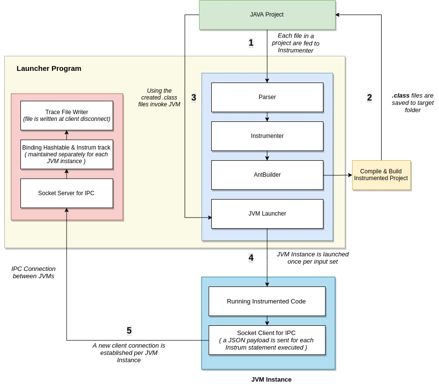

#### Prerequisites
1. JAVA SDK 11 or higher
2. Scala 2.13 or above

**Note:** The project is developed and tested on a Unix based OS. 
#### How to run
The project has two main files:
1. ServerLaunch - Launches the IPC server to listen to communications
2. InstrumLauch - Launches the instrumentation for a selected project

Below are the steps to be followed to run the project:
1. Run the file `ServerLauch.scala`. This should start a server at `127.0.0.1:8080`. Make sure that this port is free 
or else the server won't start. This file should be run first and has to be started only once for running any number of 
instrumentations. Donot close the terminal window in which this file is run
2. Run the file `InstrumLaunch.scala` to run the instrumentation. You will be provided with a list of project configuration 
files available to the instrumenter. You can choose which project to run. Running the instrumenter for more than once on the
same source file may cause unexpected results. This project already has a `Pathfinder` and `Matrix Rotation` program which 
can be used for test purposes. 
3. After each run two timestamped files will be found in the `tracefiles` directory in the project root. The file with 
`binding_` will have the formatted data of the hashtable for each variable and `trace_` will have running data of each
instrum statement executed.

`sbt` command line can also be used to run the project. Running the project from the root will provide you with option to
select which class has to run. Run both the files in two separate terminals in the order described above.
#### How to add a new project for instrumentation
Each project used is based on Ant build. Ant is used for its simplicity to bootstrap a new project
quickly. Any tool build which gives out `.class` files as output can be swapped out instead of Any. Since using Ant 
each project is expected to have a `build.xml` file with the below specification:
1. Default target is `compile`
2. A `javac` node is defined with the `destdir` property set to a folder.
3. Two dependency jars as defined below are specified in the classpath node. Only declaration for the `jars` in the build 
file is needed. The original files are copied automatically by the launcher program. 
    
    ```xml
    <pathelement path="<your_jar_folder>/nv-websocket-client-2.9.jar"/>			
    <pathelement path="<your_jar_folder>/json-20190722.jar"/> 
    ```
Below is an example of a `build.xml` which can be used as a starting point
```xml
<project default="compile">
    <target name="compile">
        <mkdir dir="target"/>
        <javac srcdir="src" destdir="target">
		<classpath>
		    <pathelement path="jars/stdlib(3).jar"/>
		    <!--Below two lines are included as per specification-->
		    <pathelement path="jars/nv-websocket-client-2.9.jar"/>			
			<pathelement path="jars/json-20190722.jar"/> 
			
	    </classpath>
	</javac>
    </target>
</project>
```
To add a new project for instrumentation perform the below steps:
1. Make sure your project is Ant buildable.
1. Add a configuration file to the folder `config/instrum`. This a configuration file and should have the extension `.conf`.
Each parameter in the configuration file is shown below: All parameters are mandatory and the program cannot procced without 
setting each of the below parameters
    1. rootRelativetoInstrumDir - Set this to `true` if the new project foler is saved inside the instrumentation project
    directory. Else set this to `false`.
    2. root - Specify path to the root of your project. If you set `true` for `rootRelativetoInstrumDir` this path should be 
    relative else you need an absolute path to be specified.
    3. srcDir - Specify path to top level directory which has `.java` code files. This is to be set relatively to the `root`
    parameter
    4. targetDir - Specify where to find the `.class` files produced by the Ant builder. This is to be set relatively to the `root`
                                                                                             parameter
    5. jarFolder - Specify the folder where your `jars` are saved. This should be the folder part of your `classpath` specification
    in the `build.xml`. This is to be set relatively to the `root` parameter.
    6. buildFile - Specify where your `build.xml` file is. This is to be set relatively to the `root` parameter.
    7. mainClass - Give the qualified name including the package structure of your main class
    8. arguments - This is a list of list. The inner list is separated by commas and each inner list consists of the arguments
    to be passed to the instrumented program.
    
    See for a sample `pathfinder.conf` file for a project saved inside the instrumentation project in the path `projects/project1`
    ```editorconfig
    compile{
      # Set this to true if the project root directory
      # is inside the instrum project directory and the provide
      # relative path to the project folder
      rootRelativetoInstrumDir = true
      root = "projects/project1"
      # Everything below this line is relative to the
      # project root
      srcDir = "src"
      targetDir = "target"
      jarFolder = "jars"
      buildFile = "build.xml"
    }
    
    run {
      # Provide the qualified main class
      mainClass = "PathFindingOnSquaredGrid"
      # Provide input parameters
      arguments = [
        [10 0.3 0 0 9 9]
      ]
    }
    ```
    
    See for a sample `pathfinder.conf` file for a project saved at `/home/sherryl/Desktop/project1`
    ```editorconfig
    compile{
      # Set this to true if the project root directory
      # is inside the instrum project directory and the provide
      # relative path to the project folder
      rootRelativetoInstrumDir = false
      root = "/home/sherryl/Desktop/project1"
      # Everything below this line is relative to the
      # project root
      srcDir = "src"
      targetDir = "target"
      jarFolder = "jars"
      buildFile = "build.xml"
    }
    
    run {
      # Provide the qualified main class
      mainClass = "PathFindingOnSquaredGrid"
      # Provide input parameters
      arguments = [
        [10 0.3 0 0 9 9]
      ]
    }
    ```

3. Make sure the project is in the path you specified as `root` and you are good to run the code.
###### Basic Troubleshooting
1. This project needs port `8080` to be free to run. If you get an `Address already in use` make sure to free the port.
For a Unix system you can run the command `sudo lsof -i:8080` and then kill the PID blocking the port.
2. If you get a `Failed to connect to 'localhost:8080'` error when running the `InstrumLaunch` make sure you have run 
`ServerLaunch` and the same is running.
#### Technical Design
Below is the overall view of the Instrumenter system and overview of all components:


#### AST Parsing and Instrumentation - #### 

The parsing and instrumentation is done in multiple steps. 
1. AST Parsing
    1. Block Rewrite
    2. Code Rewrite 
3. Instrumentation  

###### 1. AST Parsing #######
This consists of Block rewriting and code rewriting. This is done as a first step to transform the code, before we begin instrumentation. 
###### i. Block Rewrite ###### 
As part of block rewrite step, all singled statements inside control structures , are converted to blocks.

This is done for all control statements including, *for*, *do-while*, *while*, *for-each*, *if-else if-else*. 
This is done to ensure that when we need to add an additional logging statement, we do not need to handle the absence of blocks. 

*Example* - 
```java
int i = 3;
if(i < 2)
    System.out.println("hello");
else
    System.out.println("hi"); 
```
is transformed to
```java
int i = 3;
if(i < 2) {
System.out.println("hello");
}
else {
System.out.println("hi");
}
```
###### ii. Code Rewrite ######
In the code rewrite step, we transform the method invocations in the expressions in looping constructs, *for*, *while* and *do-while* into
single assignments. 

This is only  done for simple infix expressions with a single method invocation on either side of the operand; i.e. statements of the below nature, are not handled. 
```java
while(x() + x() + x() < 10) 
```

But for simple expressions involving one method invocation, we account for nested loops as well.

*Example* - 
```java
while(x() < 5) {
    do {
        System.out.println("Hi");
    } while(x()< 2);
}

int x() {
    return 2; 
}
```
is transformed to 
```java
int wh1 = x();
while(wh1 < 5) {
    int do1 = 0;
    do {   
        System.out.println(i);
        do1 = x();
    } while(do1 < 2);
    wh1 = x();
}

int x() {
    return 2; 
}
```
In addition to the loop construct transformation, we also add imports to include the Template class package (*This class includes the instrumentation method that is inserted into the original source*) and an additional last statement in the main() method to disconnect 
the socket (*This is part of the IPC to communicate back with the launcher program*).

###### 3. Instrumentation ######
Instrumentation is added to capture the variables, the bindings and their values in a Java source program. As part of this implementation, we handle the following constructs through visitors. 
1. Control structures - *for*, *while*, *do-while*, *for-each*, *if-else-if-else*, *switch*

    *Sample statement* -
    ```java
    for(int i=0; i < 10 ; i++) {
        /*Do something here.*/
    }
    ```
    *Instrumentation Statement inserted* -
    ```
    for (int x = 0; x < matrix.length; x++) 
    TemplateClass.instrum(39, "ForStatement", new AP("SimpleName", "PathFindingOnSquaredGrid.generateHValue(boolean[][], int, int, int, int, int, int, int, boolean, int).x", x), new AP("QualifiedName", "length", matrix.length));
    ```
    *Resulting trace with details of Location, Statement type, Binding and variable value* - 
    ```
    Line: 39, SeenAt: "ForStatement"
    Name: "PathFindingOnSquaredGrid.generateHValue(boolean[][], int, int, int, int, int, int, int, boolean, int).x", Type: "SimpleName", Value: "6"
    Name: "()", Type: "QualifiedName", Value: "10"
    ```
2. Return statements - Return statements at the end of a function call. 
    
    *Sample statement* -
    ```java
    return 2; 
    ```
    *Instrumentation Statement inserted* -
    ```
    return a;
    TemplateClass.instrum(21, "ReturnStatement", new AP("SimpleName", "PathFindingOnSquaredGrid.random(int, double).a", a));
    ```
    *Resulting trace with details of Location, Statement type, Binding and variable value* - 
    ```
    Line: 21, SeenAt: "ReturnStatement"
    Name: "PathFindingOnSquaredGrid.random(int, double).a", Type: "SimpleName", Value: "[[Z@27c20538"
    ```
3. Method Declarations - All method declarations along with the parameters in the method signatures. We only call out the formal parameters along with their bindings and values in the trace. The bindings include the name of the method themselves. 
    *Sample statement* -
   ```java
    public static void main(String[] args) {
        /* Do something here */
    }
    ```
   *Instrumentation Statement inserted* -
   ```
   public static void main(String[] args) 
   TemplateClass.instrum(389, "MethodDeclaration", new AP("SimpleName", "PathFindingOnSquaredGrid.main(String[]).args", args));
   ```
    *Resulting trace with details of Location, Statement type, Binding and variable value* - 
    ```
   Line: 389, SeenAt: "MethodDeclaration"
   Name: "PathFindingOnSquaredGrid.main(String[]).args", Type: "SimpleName", Value: "[Ljava.lang.String;@311d617d"
    ```       
4. Variable Declaration Statements - All variable declaration statements, including multiple declarations with initializers. 
     
     *Sample statement* -
    ```java
    int i = 0;
    int i,j;
    int i = 0, j = 0;
    ```
     *Instrumentation Statement inserted* -
     ```java
   gridSize = Integer.parseInt(args[0]);
   TemplateClass.instrum(393, "VariableDeclaration", new AP("SimpleName", "PathFindingOnSquaredGrid.main(String[]).gridSize", gridSize), new AP("MethodInvocation", "Integer.parseInt(String)", ""), new AP("inner SimpleName", "PathFindingOnSquaredGrid.main(String[]).args", args), new AP(" inner NumberLiteral", "", 0));
    ```
       
     *Resulting trace with details of Location, Statement type, Binding and variable value* - 
     ```
    Line: 393, SeenAt: "VariableDeclaration"
    Name: "PathFindingOnSquaredGrid.main(String[]).gridSize", Type: "SimpleName", Value: "10"
    Name: "Integer.parseInt(String)", Type: "MethodInvocation", Value: ""
    Name: "PathFindingOnSquaredGrid.main(String[]).args", Type: "inner SimpleName", Value: "[Ljava.lang.String;@311d617d"
    Name: "", Type: " inner NumberLiteral", Value: "0"
   
   // This translates to gridSize = Integer.parseInt(args[0]). inner SimpleName is a type that is used to signify array access. 
     ```
      
5. Expression statements - We handle instrumentation of a lot of expression statement constructs as provided by the Java language. Below is a list of constructs that we handle in our instrumentation. 
    *Sample Statements* -
    ```java
    i = x();                     //Assignment (with a method invocation).
    i = i++;                     //Assignment (postfix expression).
    i = -2;                      //Assignment (prefix expression).
    i = x() + 2;                 //Assignment (infix expression).
    cell[y][x] = new Node(y, x); //Class Instance creation.
    cell[y] = Node.y             //Field Access.
    if (node == cell[Bi][Bj])    //Array access.
    cell[0][1] = 2;              //Array initialization.
    ```
    *Sample Instrumentation Statement inserted* -
    ```java
    cell[y][x] = new Node(y, x);
    TemplateClass.instrum(41, "Assign", new AP("Array Begin", "", "{"), new AP("inner SimpleName", "PathFindingOnSquaredGrid.cell", cell), new AP(" inner SimpleName", "PathFindingOnSquaredGrid.generateHValue(boolean[][], int, int, int, int, int, int, int, boolean, int).y", y), new AP(" inner SimpleName", "PathFindingOnSquaredGrid.generateHValue(boolean[][], int, int, int, int, int, int, int, boolean, int).x", x), new AP("Array End", "", "}"), new AP("ClassInstanceCreation", "Node", "Node.Node(int, int)"), new AP("SimpleName", "PathFindingOnSquaredGrid.generateHValue(boolean[][], int, int, int, int, int, int, int, boolean, int).y", y), new AP("SimpleName", "PathFindingOnSquaredGrid.generateHValue(boolean[][], int, int, int, int, int, int, int, boolean, int).x", x));
    ```
    *Resulting trace with details of Location, Statement type, Binding and variable value* - 
    
   ```
   Line: 41, SeenAt: "Assign"
   Name: "", Type: "Array Begin", Value: "{"
   Name: "PathFindingOnSquaredGrid.cell", Type: "inner SimpleName", Value: "[[LNode;@72d818d1"
   Name: "PathFindingOnSquaredGrid.generateHValue(boolean[][], int, int, int, int, int, int, int, boolean, int).y", Type: " inner SimpleName", Value: "0"
   Name: "PathFindingOnSquaredGrid.generateHValue(boolean[][], int, int, int, int, int, int, int, boolean, int).x", Type: " inner SimpleName", Value: "0"
   Name: "", Type: "Array End", Value: "}"
   Name: "Node", Type: "ClassInstanceCreation", Value: "Node.Node(int, int)"
   Name: "PathFindingOnSquaredGrid.generateHValue(boolean[][], int, int, int, int, int, int, int, boolean, int).y", Type: "SimpleName", Value: "0"
   Name: "PathFindingOnSquaredGrid.generateHValue(boolean[][], int, int, int, int, int, int, int, boolean, int).x", Type: "SimpleName", Value: "0"
   
   This shows that an array is assigned a value new Node(y,x) 
   ```
##### Component Details
###### Launcher Program
Launcher program is divided into two:
###### 1. Instrumenter
This component deals with reading files in a JAVA project, instrumenting the code and launch JVM instances for each set 
of input. Main components are:
* Parser : Parser will run over the code and rewrites certain control structures which has single statements to blocks.
* Instrumenter : Visitors are used to visitor over predefined statements and expressions, find their names, binding in 
the current scope and value currently held. The values found are then passed to `TemplateClass.instrum()` method for 
being sent to the launcher program.
* AntBuilder : Ant is used as the build tool. Each project passed should have a `build` file. Ant is used for its simplicity.
Ant can be swapped out for any other build tool. The output of this step is `.class` files and that's all is needed from 
this step. The `.class` files will be saved into a predefined folder.
* JVMLauncher : JDI is used to launch separate instances of JVM for each set of inputs in the selected project
###### 2. IPC Server & Trace Writer
This component has two main functions
* IPC Server - This server needs to be started before the instrumenter is run. Server listens to `127.0.0.1:8080` for
incoming messages. Each message is in JSON format in the below schema:
```json
{
  line: Int,
  statementType: String,
  data: [{type:  String, binding: String, value:  String}]
}
```
Each JSON thus obtained is parsed and a hastable is maintained with the unique identifier as `binding`. And the JSON is
saved. Also a running trace is maintained to store the unprocessed JSON data which comes from the JVM instance. 
A hashtable and trace maintained for each connected client and the data is moved to timestamp named text file when each
client is disconnected.
* JSON Parser & File Writer : Has code to parse each JSON coming to the system and write files at the disconnection of 
each client.
###### JVM Instance
Each project is passed to a JVM instace. The instrumented code has two main components:
* Original Code with Instrumentation statements. Each instrumented statement will be of the form 
`TemplateClass.instrum(int line, String typeofStatement, AP... parameters)`.
* A `TemplateClass` with static members. When the static class is initialized a unique web socket connection is made
to the launcher program. This connection will be used for IPC. Every `instrum` method executed will send a JSON payload
to the launcher program for processing and saving.      